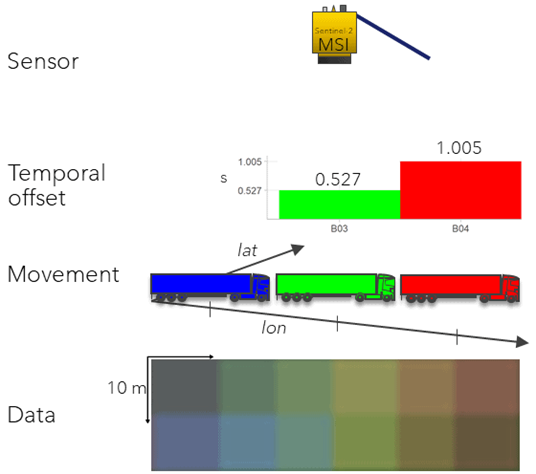
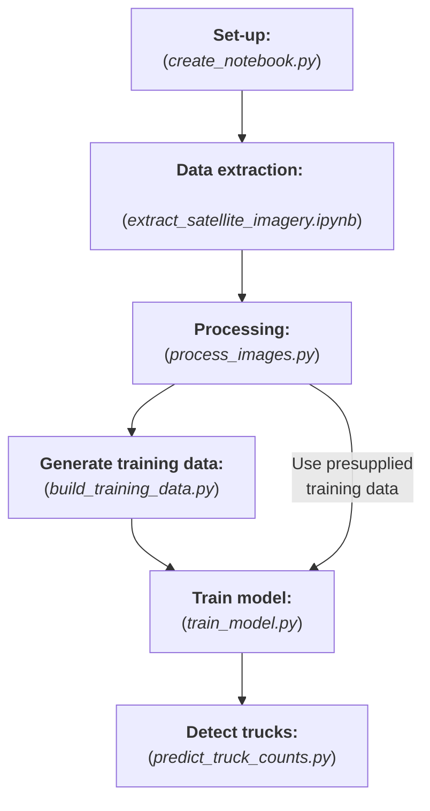

[](LICENSE)

[](https://github.com/ambv/black)
[](https://github.com/GIScience/badges#experimental)

# Faster Economic Indicators: Detecting Trucks :truck: :articulated_lorry:

This project concerns training a supervised machine learning model to detect and count the number of trucks on roads in public and freely available satellite imagery. This was an experimental research project that ultimately did not go into production - as such, this codebase represents a working prototype only.

The following README provides a brief overview of the project, but the primary project documentation (including an introduction to the project, installation instructions and an end-to-end walk-through) is available at `<insert link here when hosted online>`.

__NOTE:__ *In the meantime, this is available by cloning this repository, building the docs, and booting the file `docs/build/html/installation.html` locally.*

<!-- TOC -->
- [Faster Economic Indicators: Detecting Trucks :truck: :articulated_lorry:](#faster-economic-indicators-detecting-trucks-truck-articulated_lorry)
  - [Background <a name="background"></a>](#background-)
  - [Process Overview <a name="process-overview"></a>](#process-overview-)
- [Getting Started <a name="getting-started"></a>](#getting-started-)
  - [Installation <a name="installation"></a>](#installation-)
    - [Dependencies](#dependencies)
    - [Build the docs](#build-the-docs)
    - [Pre-commit actions](#pre-commit-actions)
- [Execution Overview <a name="execution-overview"></a>](#execution-overview-)
- [Project Structure <a name="project-structure"></a>](#project-structure-)
  - [Data Structure <a name="data-structure"></a>](#data-structure-)
  - [Documentation Structure <a name="docs"></a>](#documentation-structure-)
- [Data Science Campus <a name="dsc"></a>](#data-science-campus-)
- [Licence <a name="licence"></a>](#licence-)
<!-- /TOC -->

## Background <a name="background"></a>

In the wake of the COVID-19 pandemic in April 2020, the ONS/FCDO Data Science Hub (now called the Data Science Campus International Development team) began exploring faster economic indicators of economic activity in UK Official Development Assistance (ODA) countries. Building on previous methods of the Office for National Statistics' Data Science Campus, we set out to provide more timely estimates of economic activity though the adoption of novel data sources, including open source satellite data.

This led to the exploration of the use of low-resolution satellite data from the [European Space Agency](https://www.esa.int/)'s [Sentinel-2 (S2) satellite](https://www.esa.int/Applications/Observing_the_Earth/Copernicus/Sentinel-2), which is freely available and frequently captured, to monitor changes in road traffic in ODA-eligible countries (specifically in East Africa, with a focus on Kenya).

Tracking the flow of traffic at a higher granularity has the potential to unlock insights into the distribution of inland trade in countries which lack the infrastructure or funding required for road traffic monitoring using road sensors. As well as understanding domestic and international trade, this technique could also be used to estimate emissions from road transport, a critical task in tracking progress towards greenhouse gas emissions targets.

Following some positive findings from [Henrik Fisser's](https://github.com/hfisser) masters [project](https://github.com/hfisser/Truck_Detection_Sentinel2_COVID19), which won an S2 hub innovation competition for [detecting reductions in road traffic following lockdowns in Germany](https://www.esa.int/ESA_Multimedia/Images/2020/10/Truck_detection_using_data_from_Copernicus_Sentinel-2), a new method was developed to extract S2 images and estimate vehicle counts by training a supervised machine learning model. This process exploits the temporal offset in blue, green and red light from large vehicles on the motorway, which is seen as a ‘rainbow’ sequence of coloured pixels.


<p float="left">
  
  
</p>

## Process Overview <a name="process-overview"></a>
The key stages in this project involve:
- Extraction of Sentinel 2 satellite images for a chosen location, limited to the main roads only, within some date range.
- Processing of these images - most notably chipping the full extent of each observation image into smaller tiles for computational analysis.
- *Optional:* Manual labelling of truck positions within some subset of images in order to generate training data. Otherwise, it is possible to use pre-supplied training data (less accurate).
- Train a supervised machine learning model. By default, this is a random forest classifier.
- Predict truck counts by applying trained model to observation images.
- Estimate cloud corrected truck counts for each date using percentage cloud coverage of each image.

It was found the methodology developed here can detect broad trends in road traffic over time (such as detecting downturns in truck counts during national lockdowns) but was not robust enough for close to realtime indicators of traffic volumes, as desired. As a result, this R&D project has not gone into production and this codebase thus represents a **working prototype only**. Whilst ultimately not suitable for its original intended use case, the methodology may be applicable, adaptable or expandable for other use cases and scenarios. And in making this code public, we encourage any interested party to do just that.


For details on the methodology and results of this work, see the [technical blog post](https://datasciencecampus.ons.gov.uk/detecting-trucks-in-east-africa/) and see the project documentation for details on the codebase itself and how to run the project.

# Getting Started <a name="getting-started"></a>

## Installation <a name="installation"></a>

For detailed installation instructions it is recommended you explore the project documentation at `<insert link here when hosted online>`.

__NOTE:__ *In the meantime, this is available by cloning this repository, building the docs, and booting the file `docs/build/html/installation.html` locally.*

This project has been developed in Python and consists of a series of scripts for executing the processing and analysis (including
data processing, feature engineering, modelling & evaluation), with much of the supporting functionality found in modules.

### Dependencies
There are a number of open source and 3rd party dependencies that are required to run this codebase.

The recommended option for Conda users is to [create an environment](https://docs.conda.io/projects/conda/en/latest/user-guide/tasks/manage-environments.html#creating-an-environment-from-an-environment-yml-file) from the `environment_trucks.yml` provided.

_Alternatively_, dependencies can be installed using pip. In the terminal, the provided `requirements.txt`  can be run by:

```shell
python -m pip install -r requirements.txt
```

However, this is not recommended on a Windows machine as some packages
(namely `Fiona` and `rasterio`) are not trivial to install on Windows.

### Build the docs

The required packages for building the docs should have been installed through the dependencies section above. To build the docs navigate to the `trucks/docs/` in the terminal and run:
```shell
make clean | make html
```
As noted above you should be able to access the docs now by double clicking on the `docs/build/html/installation.html` file.

### Pre-commit actions
This repository makes use of pre-commit hooks. If approaching this project as a developer, you can install and enable `pre-commit` by running the following in your shell:
   1. Install `pre-commit`:

      ```
      pip install pre-commit
      ```
   2. Enable `pre-commit`:

      ```
      pre-commit install
      ```
These should then execute whenever you commit to this repository. The use of active pre-commits are encouraged when working with this codebase.


# Execution Overview <a name="execution-overview"></a>
In order to run through this project, the project scripts are intended to be run as follows:
(It is *highly recommended* you follow the documentation in order to correctly run these scripts with the appropriate command line arguments in place.)



# Project Structure <a name="project-structure"></a>

The code in this project is structured as follows:
```
📦src
┗ 📂python
 ┣ 📂data_processing
 ┃ ┣ 📜extract_gee_images.py
 ┃ ┣ 📜image_processing.py
 ┃ ┣ 📜masking.py
 ┃ ┗ 📜__init__.py
 ┣ 📂truck_detection
 ┃ ┣ 📜cloud_time_series.py
 ┃ ┣ 📜detect_trucks.py
 ┃ ┣ 📜feature_engineering.py
 ┃ ┗ 📜__init__.py
 ┣ 📂utils
 ┃ ┣ 📜column_headers.py
 ┃ ┣ 📜file_handling.py
 ┃ ┗ 📜__init__.py
 ┣ 📜build_training_data.py
 ┣ 📜config.yaml
 ┣ 📜create_notebook.py
 ┣ 📜extract_satellite_imagery.py
 ┣ 📜predict_truck_counts.py
 ┣ 📜process_images.py
 ┗ 📜train_model.py
```


1. `create_notebook.py`: converts data extraction script into required notebook form.
1. `extract_satellite_imagery.ipynb`: this notebook contains all steps in extracting and processing sentinel-2 images from GEE. There are manual steps involved in this.
2. `process_images.py`: processes images and performing chipping functionality
3. `build_training_data.py`: This is an *optional* step which generates training data specific to your chosen location of interest. This process requires manual labelling of data. Alternatively, pre-supplied training data is available.
4. `train_model.py`: trains a supervised ML model (by default random forest classifier).
5. `predict_truck_counts.py`: processes all images and applies model in order to predict truck counts.

A full index of the modules and their function documentation are available in the documentation pages.


## Data Structure <a name="data-structure"></a>
When executing the scripts, data will be stored and processed in the following overall structure, where `<location>` is the string representation of the location of interest:

```
 📦data
  ┣ 📂<location>
  ┃ ┣ 📂final
  ┃ ┣ 📂processed
  ┃ ┃ ┣ 📂chips
  ┃ ┃ ┃ ┣ 📂temporal_mean_imgs
  ┃ ┃ ┣ 📂predictions
  ┃ ┃ ┣ 📂training
  ┃ ┗ 📂raw
  ┃ ┃ ┣ 📂s2_images
  ┃ ┃ ┗ 📜<location>.osm.pbf
  ┣ 📂preprepared_training_data
  ┃ ┣ 📜nairobi2_training_features.csv
  ┃ ┗ 📜nairobi_training_features.csv
```

## Documentation Structure <a name="docs"></a>

This repository *currently* contains all the source code for generating the documentation material using Sphinx.
This documentation code is structured as follows:
```
📦docs
 ┣ 📂build
 ┃ ┣ 📂doctrees
 ┃ ┗ 📂html
 ┃ ┃ ┣ 📜authors.html
 ┃ ┃ ┣ 📜index.html
 ┃ ┃ ┣ 📜installation.html
 ┃ ┃ ┗ 📜tutorial.html
 ┣ 📂source
 ┃ ┣ 📂images
 ┃ ┣ 📜authors.rst
 ┃ ┣ 📜conf.py
 ┃ ┣ 📜index.rst
 ┃ ┣ 📜installation.rst
 ┃ ┗ 📜tutorial.rst
 ┣ 📜make.bat
 ┗ 📜Makefile
```


# Data Science Campus <a name="dsc"></a>
The project was developed by the International Development squad (formlerly called the [ONS/FCDO Data Science Hub](https://datasciencecampus.ons.gov.uk/ons-fcdo-data-science-hub/)) within the Data Science Campus of the Office for National Statistics.

At the [Data Science Campus](https://datasciencecampus.ons.gov.uk/about-us/) we apply data science, and build skills, for public good across the UK and internationally. Get in touch with the Campus at [datasciencecampus@ons.gov.uk](datasciencecampus@ons.gov.uk).

# Licence <a name="licence"></a>

<!-- Unless stated otherwise, the codebase is released under [the MIT Licence][mit]. -->

The code, unless otherwise stated, is released under [the MIT Licence][mit].

The documentation for this work is subject to [© Crown copyright][copyright] and is available under the terms of the [Open Government 3.0][ogl] licence.

[mit]: LICENCE
[copyright]: http://www.nationalarchives.gov.uk/information-management/re-using-public-sector-information/uk-government-licensing-framework/crown-copyright/
[ogl]: http://www.nationalarchives.gov.uk/doc/open-government-licence/version/3/
