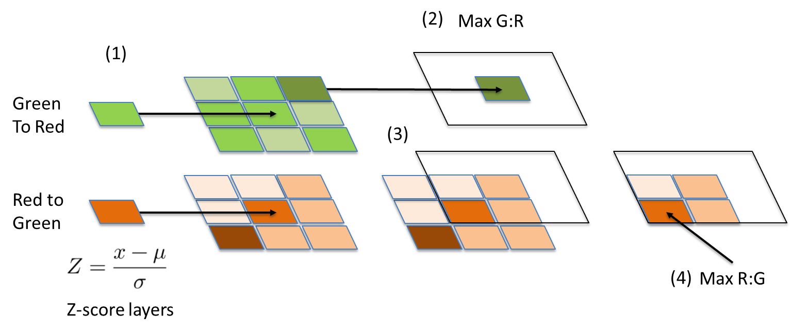
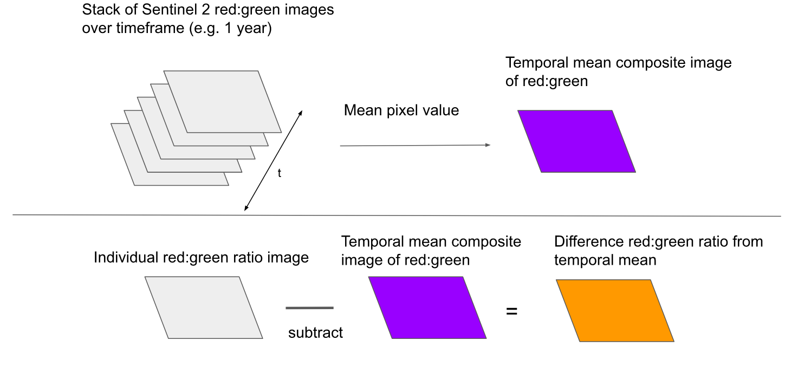

.. highlight:: shell

===================
Project Description
===================

Background
----------

In the wake of the COVID-19 pandemic in April 2020, the ONS/FCDO Data Science Hub began exploring faster economic indicators of economic activity in UK Official Development Assistance (ODA) countries. Building on previous methods of the ONS's Data Science Campus, we set out to provide more timely estimates of economic activity though the adoption of novel data sources, including open source satellite data.

This led to the exploration of the use of low-resolution satellite data from the
`European Space Agency <https://www.esa.int/>`_'s `Sentinel-2 (S2) satellite <https://www.esa.int/Applications/Observing_the_Earth/Copernicus/Sentinel-2>`_
to monitor changes in road traffic in ODA-eligible countries (specifically in East Africa, with a focus on Kenya).

Tracking the flow of traffic at a higher granularity has the potential to unlock insights into the distribution of inland trade in countries which lack the infrastructure or funding required for road traffic monitoring using road sensors. As well as understanding domestic and international trade, this technique could also be used to estimate emissions from road transport, a critical task in tracking progress towards greenhouse gas emissions targets.

Following some positive findings from `Henrik Fisser's <https://github.com/hfisser>`_ masters `project <https://github.com/hfisser/Truck_Detection_Sentinel2_COVID19>`_, which won an S2 hub innovation competition for `detecting reductions in road traffic following lockdowns in Germany <https://www.esa.int/ESA_Multimedia/Images/2020/10/Truck_detection_using_data_from_Copernicus_Sentinel-2>`_, a new method was developed to extract S2 images and estimate vehicle counts by training a supervised machine learning model. This process exploits the temporal offset in blue, green and red light from large vehicles on the motorway, which is seen as a 'rainbow' sequence of coloured pixels.

|offset_trucks| |truck_signal_example|

.. |offset_trucks| image:: images/sentinel_2_truck_offset.png
   :width: 47%
..  alt="A diagram showing a truck moving through time and hence colour bands on the S2 sensor to form the sequence of coloured pixels..png

.. |truck_signal_example| image:: images/truck_signals.PNG
   :width: 47%
.. alt="Screenshot of the characteristic sequence of blue, green and red pixels in a satellite image of a road."

Methodology
-----------

This project concerns training a supervised machine learning model to detect and count the number of trucks on roads in freely available and frequently released satellite imagery. The key stages are:

* **Extraction** of Sentinel 2 satellite images. This process makes use of polygons describing the main roads in a chosen location in order to extract images for the immediate extent around the roads only (thus saving computational expense).
* **Processing** of these images - most notably chipping the full extent of each observation image into smaller tiles for easier computational analysis and masking clouds from the images.
* *Optional:* Manual labelling of truck positions within some subset of images in order to **generate training data**. *Otherwise*, it is possible to use the pre-supplied training data (but which will be less accurate than data trained at a specific location). The training data consists of a bespoke set of features that result from the feature engineering detailed below.
* **Train** a supervised machine learning model. By default, a random forest classifier is used, however, the codebase is adaptable to train alternative models and to fine tune the parameters in the chosen model.
* **Predict** truck counts by applying the trained model to observation images.
* Estimate final cloud corrected **truck counts** for each date using the percentage cloud coverage of each image.

It was found the methodology developed here can detect broad trends in road traffic over time (such as detecting downturns in truck counts during national lockdowns) but was not robust enough for close to realtime indicators of traffic volumes, as desired. As a result, this R&D project has not gone into production and this codebase thus represents a **working prototype only**. Whilst ultimately not suitable for its original intended use case, the methodology may be applicable, adaptable or expandable for other use cases and scenarios. And in making this code public, we encourage any interested party to do just that.

For a detailed description on the methodology and finding of this work, see the Campus' `technical blog post <https://datasciencecampus.ons.gov.uk/detecting-trucks-in-east-africa/>`_.

.. _feature-engineering:

Feature engineering
*******************

The signal for trucks is characterised by a close sequence of *blue-green-red* pixels.
A bespoke system of features was developed to best capture this signal, which can then be used
to train a model.

For a detailed description of the feature engineering see the `blog post <https://datasciencecampus.ons.gov.uk/detecting-trucks-in-east-africa/>`_.
Briefly however, a combination of spatial and temporal features are combined to maximise the truck signal relative to the background noise.

The spatial approach involves defining a wider kernel around each pixel. In this kernel, the relative colour values (e.g. the ratio of red to green,
rather than just the red value) is calculated. Exploratory analysis showed the relative ratios are better able to distinguish truck pixels from road pixels.
This technique takes into account the closeness of pixels and the sequential *blue, green, red* order of the truck effect. In building training data, truck signals are labelled on the blue pixel only; however, we know for true truck signals there should be a green pixel near to this blue pixel and a red pixel quite near, but a bit further away than the green. So the approach is to get the "most green" pixel value nearby, (defining green-ness as its relative value to red / blue), then get the "most red" pixel value (again relative to green / blue) connected to the most green pixel value. Doing so within a multiple pixel kernel allows us to capture the sequential connectivity between the *blue, green, red* pixels in a true signal.

|pixel_kernel|

Temporal information is also utilised. The colour of a pixel relative to the mean colour over all dates in that pixel location is captured, smoothing out observation effects in an individual image. To detect this temporal signal, a composite mean image is created from all rasters in the time series and the temporal mean values for each feature are subtracted from the feature values in a specific date, giving a 'subtracted' image, from which a *Z*-score for each pixel is calculated.

|temporal_technique|

For more details see the `blog post <https://datasciencecampus.ons.gov.uk/detecting-trucks-in-east-africa/>`_.

Limitations
-----------

There a number of limitations in the data, approach and techniques used which contributed to the unfeasibility of our
intended use case and are important to bare in mind in any work in space.

* The training data is highly imbalanced and the model performance is highly sensitive to the ratio between between truck and non-truck pixels in the training data.
* Labelling of truck positions is subjective. Some signals are very clear, but many are ambiguous with no ground truth source for whether an apparent signal is indeed a truck or not.
* Cloud coverage can completely block imagery of the roads.
* Additionally, diffraction at cloud edges can create rainbow effects similar to the truck detection signal.
* When we say "trucks", we really mean any substantially large moving vehicle (so likely to include buses and coaches etc).
* S2 imagery is low resolution (10m), so narrow roads lead to blending of pixels at road edges, resulting in poor signal to noise ratios for truck signals. So this approach is only functional on main, wide highways.
* The characteristic signal is not created by slow moving or stationary vehicles, so congestion would lead to undercounts.
* Whilst reasonably frequent, the revisit times of several days for S2 imagery means truck counts are only a snapshot of one single moment in a space of a week or so.
* The existing approach makes no consideration of seasonality and its affect on the imagery data throughout the year (such as differing lighting conditions and the colour of roads under rainy or snowy conditions etc).
