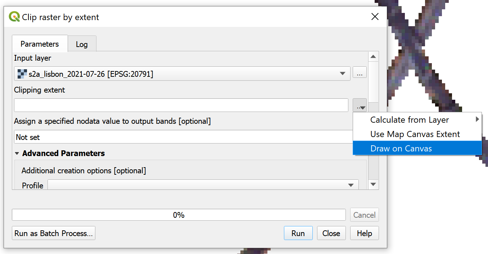
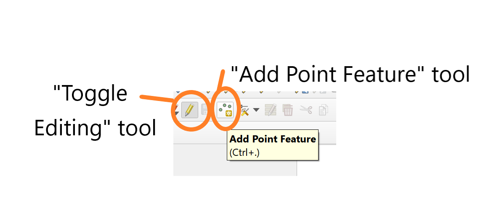

.. highlight:: shell

============
Walkthrough
============

This page provides a step-by-step, beginning-to-end guide on how to run this project.

The data
--------

The `Copernicus Sentinel-2 <https://sentinel.esa.int/web/sentinel/missions/sentinel-2>`_
mission is an Earth observation mission run by the
`European Space Agency (ESA) <https://www.esa.int/>`_.
The Sentinel 2 (S2) imagery is open data, free to download from ESA via the
`Copernicus Open Access Hub <https://scihub.copernicus.eu/>`_
or from various other sources, including Google Earth Engine.
The satellite covers most of the landmass of Earth, at an
imaging resolution of 10m, with typical revisit times of 5 to 10 days.

This project is optimised for extraction from Google Earth Engine (GEE) and
therefore it is a requirement that you register for a free GEE account.

Extracting the data
--------------------

There is a minor set-up stage in order to generate the notebook required for extracting the data.
This is achieved by running the following in the terminal in the `src` code folder:

.. code-block:: bash

   python create_notebook.py

This should have generated a notebook titled `extract_satellite_imagery.ipynb`.
Unavoidably, there are a number of manual steps in this process, but the notebook contains detailed guidance on how
to acquire the required data. Broadly this involves:

* Sign up to Google Earth Engine (GEE)
* Choose a location of interest - i.e. select a bounding box containing the particular roads which you are aiming to measure truck traffic on.
* Run some initial preprocessing which selects on the road geometry.
* Choose correct CRS based on location or interest
* Upload shapefile to GEE as a data asset
* Select a desired date range over which to extract images.
* Execute S2 export in GEE
* Download S2 imagery from Google Drive account and place in correct data dir.

Successful execution of the notebook should result in a series of tif files being
available in `data/<location>/raw/s2_images`.

Add parameters to configuration file
----------------------------------------

There are some common variables that are necessary to run the various Python
scripts. These variables can be passed as command line arguments when running
each script. But an easier option is to populate the provided `config.yaml` with
these values, which are then read by default by the scripts when no command line
arguments are given.

Open the `config.yaml` and replace the following parameters:

* `location`: is the string representing the location of interest. This should be the same string defined in the daa extraction notebook for image extraction, as used in image and directory naming.
* `single_date`: is the date of one of the S2 images extracted in the previous step. This is in the format of "yyyy-MM-dd". The choice of date is inconsequential, but it must match one of the filenames for the images.

E.g. in the example below of some extracted S2 images, the `location` is "lisbon" and a valid `single_date` to use would be "2021-01-07".

.. _chip_single_image:

Process and chip images
-----------------------

The next step is to process the images into the required format. One key component
of this is to chip the images (i.e. to chop up each observation image into smaller
tiles or "chips").

This avoids computer processing limitations when trying to load, combine and
manipulate large rasters into memory. Instead, the processing and model
prediction steps can be applied to multiple smaller images covering the same
extent and the final truck counts summed across all chips.

The functionality described above is handled by the `process_images.py` script.
In order to execute this please run the following in your terminal:

.. code-block:: bash

   python process_images.py

Or, if wanting to execute on parameters differing to those in your `config.yaml`
file, then execute:

.. code-block:: bash

   python process_images.py --location <location> --date <date>

where the optional `--location` and `--date` tags allow you to specify the following:

* `<location>`: is the string representing the location of interest.
* `<date>`: is the date of one of the S2 images extracted in the previous step.

.. note::

   The details about the possible command line arguments for each script can be explored with the `-h` command. For example:

   .. code-block:: bash

      python some_script.py --help

After the first execution, this script can also be executed in "chipping focussed" mode in order to generate the chips for another
specific observation date. This is achieved by running the following:

.. code-block:: bash

  python process_images.py --chip_focussed yes -d <the date of interest>

Training data (Optional)
------------------------

This stage is optional as some pre-prepared training data is provided in this project.
For testing purposes these training data should suffice, however, performing this stage is *highly recommended*
if accurate predictions are desired. The roads
in the training data provided (which are from Nairobi, Kenya) are likely to look different
to the roads of interest for you, in properties such as colour and width (which are factors that are
likely to affect model performance).

Label training data
^^^^^^^^^^^^^^^^^^^

This stage is unavoidably labour intensive, with manual eye-balling of images
and selecting truck-like signals. The recommended software for this is the open source
package `QGIS <https://www.qgis.org/en/site/>`_,
(the visual guides included in these docs are from `QGIS version 3.16.14-Hannover`).

The first stage is to start visually inspecting the *full frame* S2 images
located in the 'processed/s2_images' directory, using QGIS. We do this with the
full image rasters, *and not the chipped images*, because we want flexibility in the
size of the final training image area. You are aiming to identify two or three
dates where the roads are clearly visible (i.e. free from cloud) and some signature
truck-like rainbow signal is present. Below the image on the left shows a good example
to choose, with the signature truck signal appearing, and on the right, an example
of an image where cloud coverage makes it unsuitable.

|pic1| |pic2|

.. |pic1| image:: images/road_trucks_example_labelled.png
   :width: 48%

The truck effect appears as *blue, green, red* pixels in that order.
The labelled truck points need to selected on the blue pixel only of the truck effect
(this is a crucial assumption for all feature engineering that follows).
Therefore a subtle but important step is to ensure QGIS is using the correct bands
to display the colour image so the blue pixels in the images are indeed blue.
By default, QGIS opens the rasters bands in the incorrect order so you should
update your settings.
Go to "Settings" > "Options" > "Rendering" > "Rasters: RBG bands" and set Red band to
number 3 and Blue band to 1 (see image for guidance).

|qgis_bands_settings|

To check this has worked, with an image open, right click the filename in the "layers" box and select properties.
A dialogue box will appear, the bands should match the example given below with "Red band" in QGIS containing "Band 3: Red" and the
"Blue band" in QGIS containing "Band 1: Blue" as shown. If so, the image will be a true colour
image and we can begin labelling truck positions.

|qgis_bands|

The next step is to take a subsection of the image for labelling. The size of the
extent you choose is very subjective - the factors to consider is that:

* You want a large enough area that plenty of truck signals are present (a few tens of signals e.g. 30 is ideal).
* You don't want too large an extent that labelling becomes extremely time consuming since you will need to label *every* truck signal within your extent (see note below).
* You will need to repeat this process for multiple dates (minimum two or three), so bare this in mind with regards to the size of your box and the time commitment in labelling this.

.. tabs::

   .. tab:: Rationale behind labelling in a sub-area

      It is important to note that all pixels not labelled as trucks will be classified as non-truck. Therefore we want to select *all* truck signals within any particular raster we label from, otherwise a non-labelled truck signal could contaminate our non-truck data, to the detriment of our model. This is why we label on a smaller subsection of our images as our full frame extent may be very large, which would require a lot of labelling. Additionally, it is of benefit to use a selection of different dates as the lighting conditions in any particular observation may make the appearance of the roads (in terms of colour for example) non-representative of the normal.

In order to select a sub-region of an image:

* First, with one of your chosen observations open, click the "Processing" tab and select the "Toolbox" (or use shortcut Ctrl+Alt+T).
* In the toolbox, search for "clip raster" and select the "Clip raster by extent" option.

|clip_tools|

.. |clip_tools| image:: images/open_clip_tool.PNG
   :width: 85%

NOTE: If the toolbox is not visible, try "View" > "Panels" > and there should be a "Processing Toolbox" checkbox.

* In the clipping dialogue box, ensure the correct input layer is there (this should be the image you have chosen to label), then in the clipping extent box, select the "Draw on Canvas" option in the drop down box.

|clip_by_extent|

* Draw the extent you wish to use for labelling trucks, taking into consideration the factors outlined earlier, and click "Run".
* This should have created a new layer, called "Clipped Extent". We should rename and save this into our training data directory. Right click the layer, select "Export" and "Save As".

|save_extent|

On the dialogue box that appears, ensure the following:

* Output mode = "Raw data"
* Format = GeoTIFF
* File name set to "`data/<location>/processed/training/<location>_training_area_<date of image>.tif`"
* CRS should match that of your images.

|save_file|

**Note:** Of course, if your full image area is not prohibitively large, and you wish to label the full extent that is possible.
If that is the case, you can skip the above stages and instead copy the images you want to label into the
"`processed/training`" directory and rename them with the following format: `<location>_training_area_<date of image>.tif`.
The labelling stages next would be the same.

You are ready to label the trucks now. The first step is to build an additional shapefile layer by selecting
the "New Shapefile Layer" option in the top left of the QGIS page. Then, in the dialogue box update the following:

* Set the "File name" to "`data/<location>/processed/training/<location>_training_points_<date of image>.shp`"
* Set the "Geometry type" to "Point", and
* Ensure the correct CRS is in place.

|shapefile|

Now we can begin labelling the truck positions. With the shapefile layer selected, click on the pencil to "Toggle Editing". Then, click the
"Add Point Feature".

|add_points_tool|

Now start adding points at each truck-like signal. Recall, the truck signal is characterised a sequence of *blue, green, red* pixels in that order.
The labelled truck points need to selected on the blue pixel only. To add a point click on the blue pixel and then a dialogue box will
appear, just hit enter at this point (the entry you add to the "Id" field here is irrelevant and can be ignored - QGIS will add Null values, but this
is of no consequence).

**Useful tip:** With the "Add point feature" tool active, you can move around the image with the middle scroll wheel of your mouse.
Scrolling to zoom in and out and holding it down to drag the screen.

|add_trucks|

Some truck signals are very strong and obvious, but many are ambiguous.
There is unfortunately, no way to confirm whether an apparent truck pattern of blue, green, red pixels in close sequence
is indeed from a truck (or more accurately, large moving vehicle), so labelling is inherently subjective. This is an important
but unavoidable caveat in this project and methodology.

Once you have selected *all* likely truck signals in the extent of your training area image, ensure you save the shapefile layer.
Congratulations, you have completed labelling one image!

As mentioned, it is best to run this process on multiple dates (at least two or three) to get sufficient numbers of labelled trucks for accurate modelling and
to cover a variety of lighting conditions in the images.

To label training points for another date do the following:

* With the desired image layer open, similar to above, click the "Processing" tab and select the "Toolbox" (or use shortcut Ctrl+Alt+T).
* In the toolbox, search for "clip raster" and select the "Clip raster by extent" option.

|clip_tools_rev|

.. |clip_tools_rev| image:: images/open_clip_tool.PNG
   :width: 85%

* Except, this time in the clipping dialogue box, select the "Calculate from Layer" option in the drop down box.
* Select the "`training_area`" raster layer created above.

|layer_extent|

Then follow the same procedure above to "Export" and "Save As", ensuring you save it with the date of the image you are processing included in the file name. Then add a new points shapefile layer, as instructed above, and save it (again being careful to use the correct date in the file name). Then select the truck signals again for this new date and save the output.

Repeat this process for as many dates as is appropriate. There is no magic number for the number of dates you repeat this
process. There are benefits to using more dates in terms of generating a larger sample of labelled truck and exposing
the model to a wider variety of road conditions under different lighting etc, but this has to be balanced with the
time and labour cost of doing this process. Empirically, as a general rule of thumb, it seems the model performance is poor
until around the 100 labelled trucks milestone. So, two or three dates are the likely minimum (depending on the training area
extent and volume of trucks in your area of interest). In short, do as many as possible that you are comfortable doing.

Perform feature engineering and generate training data
^^^^^^^^^^^^^^^^^^^^^^^^^^^^^^^^^^^^^^^^^^^^^^^^^^^^^^

With our training points in hand we can build our training data. To do this, run:

.. code-block:: bash

  python build_training_data.py

This script performs the feature engineering (described in more detail in the :ref:`feature-engineering` section) and
should have generated a CSV file into the "`processed/training`" directory. This CSV
contains the feature values for all the positions you have labelled as trucks and assigned these
"ml_class" value of 1. Every other pixel in your training area images will have been assigned as
non-truck positions (with `ml_class` set to 0) and had their feature values calculated also.

To check the number of labelled trucks in your training dataset (i.e. the sum of the
`ml_class` column in the CSV) run the following:

.. code-block:: bash

  python build_training_data.py --num_trucks yes

Train the model
---------------

At this stage we are ready to train a classifier model to learn to recognise the
truck signal and be able to predict unlabelled truck detections. By default, the
project utilises a `random forest classifier <https://towardsdatascience.com/understanding-random-forest-58381e0602d2>`_.

The default behaviour in the training model script is to use the pre-supplied
training data from Nairobi, Kenya. As mentioned, this is suitable for a test run, but
performance is likely be better using a training dataset created on your location of
interest. In order to train a model using the pre-supplied training data, simply run:

.. code-block:: bash

  python train_model.py

To run with the custom training dataset created in the stage above, run:

.. code-block:: bash

  python train_model.py --custom_training yes

If running for the first time, it is recommended you perform a model evaluation, in
order to validate the training data. This will perform a K-fold cross validation on
the training data and produce
a `PR AUC <https://sinyi-chou.github.io/classification-pr-curve/>`_ diagram.
To do this, depending on whether you have generated training data, run:

.. code-block:: bash

  python train_model.py --custom_training yes --evaluate_model yes

or

.. code-block:: bash

  python train_model.py --evaluate_model yes

**Note:** The default behaviour is to train a
`random forest classifier <https://towardsdatascience.com/understanding-random-forest-58381e0602d2>`_
model, with 100 trees. The number of non-truck pixels will also be downsampled to a ratio
of 100 non-truck data points per truck data point. There is the ability to modify the model
type and model parameters and test the performance of this, however there is not a streamlined
user interface for this. If this is something you are interested in doing, you will need to
modify the parameters in source code within the `train_model.py` script itself.

**Note:** In exploration and validation of this project it was discovered there is a
strong dependency on model performance with the truck to non-truck sample ratio in
the training data. A detailed discussion of this is available in the `technical blog
post <https://datasciencecampus.ons.gov.uk/detecting-trucks-in-east-africa/>`_ on the Data Science Campus website.

The outputs at this stage are pickled model and scalar files saved in the "`Outputs`"
directory in this project.

Apply model and predict truck counts
------------------------------------

The script `predict_truck_counts.py` executes the application of the trained model.
This will execute the complete process of chipping all of the S2 observations available in your data
store and then applying the model on each of these to predict truck counts for each date.

When running for the first time, it is advisable to test the model application process on a
single observation date. This provides an opportunity to check the model results before
committing to the full execution (which can take considerable time, due to the chipping) and
revisit the model training stage if needed. In order to execute on a single date run:

.. code-block:: bash

  python predict_truck_counts.py --test_date <insert_date_here>

*Note* that in this mode the chipping procedure is not executed, so the test date should
be that of a observation previously chipped. If you want to test on a specific date not
already chipped you will need to execute the `process_images.py` script in chip
focussed mode as described above (see :ref:`chip_single_image`).

In order to execute the full process of chipping each image and predicting truck
counts for each, run:

.. code-block:: bash

  python predict_truck_counts.py

When complete, this will generate a cloud corrected CSV file containing a time series of estimated truck counts for
each date. The cloud correction procedure takes a simple approach of returning the proportion of each image
that is covered by cloud (i.e. the proportion of pixels with a cloud probability exceeding the given
cloud threshold {default 25%}) and factor this with the truck counts. Such that, for example, the number of trucks
would be doubled for an observation where half the image is likely to be cloud in order to correct
for half the image being unsuitable for truck detection.

For each date, the script will also generate a shapefile where each polygon corresponds to a
positive truck detection. These can be visually inspected in QGIS, overlaid onto the satellite
imagery to manually inspect the model output with the pixel patterns. A reliable model
should of course predict a truck detection at positions where a clear blue-green-red signal
is present and not predict trucks where it is clearly lacking. Without any ground truth
data for true truck counts on any snapshot in time this is the only model verification
process you can deploy, which is an important limitation of this technique and project.
It is possible to compare general trends in truck volume over time with
some ground truth data sources (such as weigh bridges; as was conducted for this
work - see our `technical blog
post <https://datasciencecampus.ons.gov.uk/detecting-trucks-in-east-africa/>`_) but this is limited due to
static nature of the in-frequent snapshots when S2 images are taken.

Congratulations, you have completed a successful (we hope) run through of this project.
Thank you for your interest in this work. By making this code public we hope you can find ways to improve and expand upon on this work
in new and wonderful ways, good luck!
